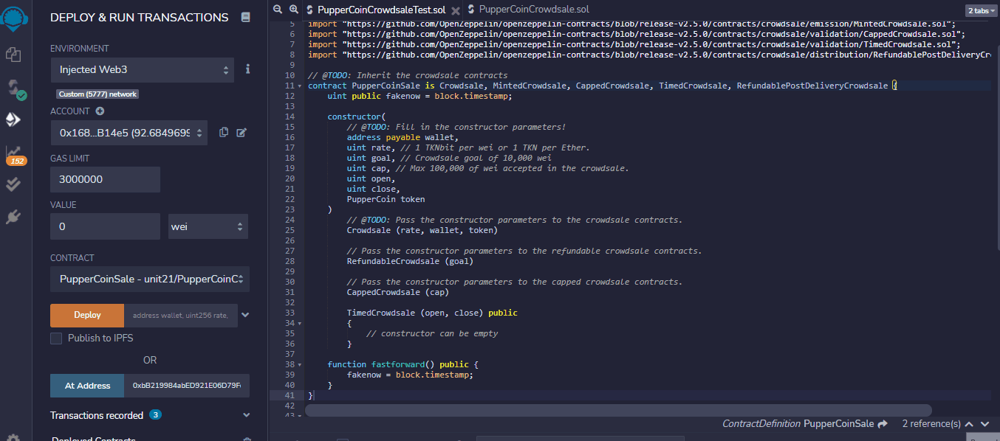
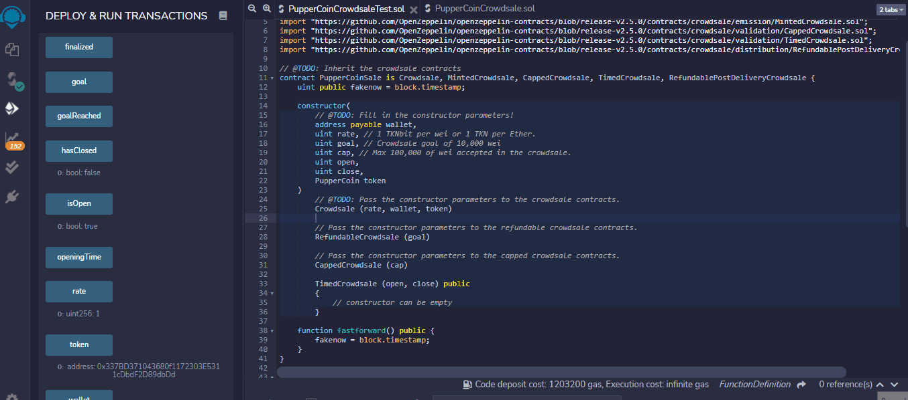
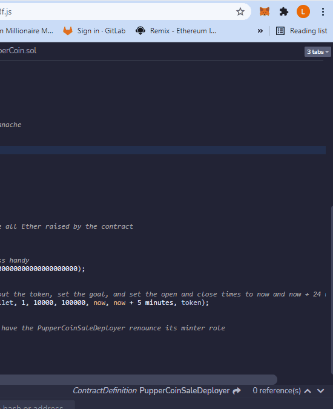
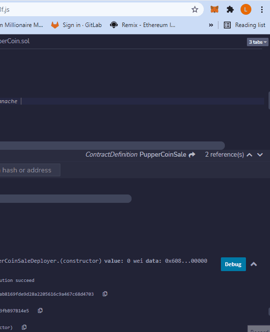

# Unit 21: Advanced Solidity - PupperCoin

This smart contract is deploying a crowdsale for the PupperCoin token, token name PUP to help fund the network development. This network will be used to track dog breeding activity across globe in a decentralized way. If our goal is not met, we will refund all funds of the crowdsale to our investors.

### **Crowdsale Goal:**
### 10,000 wei

### **Crowdsale Cap:**
### 100,000 wei

### **Length of Crowdsale:**
### 24 weeks
---
## **How to Purchase PUP**
1. On the PupperCoinCrowdsaleTest.sol file, you can purchase Tokens with the buyToken function. Input the amount in wei and 1 TKNbit per wei will be put in escrow under your wallet address until the closing date of 10 days.



2. The crowdsale will close after ```10 minutes``` from when you first deploy the crowdsale contract. In order for Ganache to register the ```block.timestamp```, you will need to use the ```fastforward``` function to interact with the contract before using the ```finalize``` function.

3. After finalizing the crowdsale, you are able to ```withdrawTokens``` into your wallet. You then can check your balance on the ```PupperCoin``` contract.

-   Please take note that, withdrawals of Tokens is **ONLY** possible when the goal of **10,000 wei** is reached. Otherwise, you can claim a refund of your investment with the ```claimRefund``` function.



## **Adding PUP Token to MetaMask Wallet**
1. To check your token balance on your MetaMask wallet, open up MetaMask and click on ```Assets```, then ```Import Tokens```.

2. Copy and paste the ```token_address``` onto the ```Token Contract Address``` field. The ```Token Symbol``` and ```Decimal``` fields should fill on their own to correspond with the token related to the ```token_address```.

3. Confirm and Import Tokens.



4. After using the ```PupperCoinCrowdsale``` contract to ```withdrawTokens``` when the crowdsale is finalized, the balance will reflect on your MetaMask wallet.
- The goal of the crowdsale for this testnet is 10,000 wei equivalent to 10,000 TKNbits or 0.00000000000001 TKNs. MetaMask extension only displays 10^10 decimal places.

